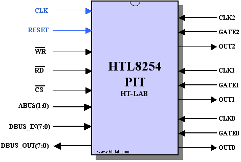

# HTL8254 82C54 Compatible Programmable Interval Timer IP core

<p align="center">

</p>

## 1. Introduction

The HTL8254 is a compatible synchronous implementation of the industry standard 8254/82C54 Programmable Interval Timer (PIT). The PIT can be used for a wide range of timing functions. The HTL8254 has three independent programmable 16 bits counters each capable of timing and waveform generation capabilities. The HTL8254 is written in vendor neutral VHDL and can be synthesized for either ASIC, FPGA or CPLD implementation.


## 2. Directory Structure

The directory structure is as follows:


| **Directory**     | **Contents**                                            |
| ----------------- | ------------------------------------------------------- |
| HTL8254\bin       | Any executable files such as utilities (might be empty) |
| HTL8254\doc       | Documentation and Datasheets                            |
| HTL8254\rtl       | Synthesizable IP Core                                   |
| HTL8254\testbench | Testbench files                                         |
| HTL8254\simulation| Example script for Modelsim Simulator                   |
| HTL8254\synthesis | Synthesis script                                        |


## 3. Filelist

The HTL8254 RTL design is contained in 7 VHDL files.

| **Filename** | **Contains**                                                                    |
| ------------ | ------------------------------------------------------------------------------- |
| cemodule.vhd | Counter logic (CE, CR, OL modules)                                              |
| ctrlword.vhd | Control Word Logic                                                              |
| edge3ff.vhd  | Dual FF followed by edge detector                                               |
| ctrlout.vhd  | Finite State Machine controlling OUT signal and counter reloads                 |
| gateclk.vhd  | Clock and Gate I/O module                                                       |
| timer.vhd    | Timer containing all above modules, instantiated for each of the three counters |
| htl8254.vhd  | Top level HTL8254                                                               |


A further 4 files are used for the testbench.


| **Filename**              | **Contains**                                         |
| ------------------------- | ---------------------------------------------------- |
| htl8254\_tester.vhd       | Testbench generic stimulus module                    |
| htl8254\_tester\_wave.vhd | Testbench stimulus to create datasheet wave diagrams |
| htl8254\_tb.vhd           | Testbench, instantiates HTL8254 and Tester module    |
| utils.vhd                 | Testbench support package                            |


## 4. Simulation

The HTL8254 IP core is written in vendor neutral VHDL and as such can be simulated by any simulation tool. The testbench however uses Siemens’ Modelsim *SignalSpy* in order to provide a non-intrusive Counter Element (CE) and OUT signal read. 

The testbench contains 2 stimulus files, a general simulus file (htl8254_tester.vhd) and a waveform one (htl8254_tester_wave.vhd) which generates the 3 “datasheets diagrams” for each of the HTL8254 modes. Both stimulus files are executed using a DOS batch file.

To run the general simulation, execute the **simulation\run.bat** batch file from a CMD/Dosbox prompt. An equivalent Modelsim run.do file can be executed from within the Modelsim GUI.

The output should be similar to the text shown below, the full expected output can be found in the simulation directory.

```
#  run -all
# ======= Test1 Mode0 CNT0, Status after reset =======
# Status0 : OUT=0 NULL_CNT=0 LMSB MODE0 BINARY CNT=0000
# Status1 : OUT=0 NULL_CNT=0 LMSB MODE0 BINARY CNT=0000
# Status2 : OUT=0 NULL_CNT=0 LMSB MODE0 BINARY CNT=0000
# ======= Test2 Mode0 CNT0, LSB only, Binary =======
# -- Writing 3 to Count Register LSB
# Counter Element 0 = 0000 OUT0=0
# Counter Element 0 = 0003 OUT0=0
# Counter Element 0 = 0002 OUT0=0
# Counter Element 0 = 0001 OUT0=0
# Counter Element 0 = 0000 OUT0=1
# ======= Test3 Mode0 CNT0, MSB only, Binary =======
...
...
# ======= Test32 Mode0 CNT0, LSB/MSB, combined Status/Latch Readback command =======
# -- Write 1004 to Counter 0
# Counter Element 0 = 0094 OUT0=0
# Counter Element 0 = 1004 OUT0=0
# Counter Element 0 = 1003 OUT0=0
# Counter Element 0 = 1002 OUT0=0
# -- Issue Read-Back Status/Latch Command, but do not yet read it
# Counter Element 0 = 1001 OUT0=0
# Counter Element 0 = 1000 OUT0=0
# Counter Element 0 = 0FFF OUT0=0
# Counter Element 0 = 0FFE OUT0=0
# -- First Counter read returns the status = 30
# Counter Element 0 = 0FFD OUT0=0
# Counter Element 0 = 0FFC OUT0=0
# Counter Element 0 = 0FFB OUT0=0
# -- Second Counter read returns the latched value = 1001
# Counter Element 0 = 0FFA OUT0=0
# Counter Element 0 = 0FF9 OUT0=0
# Counter Element 0 = 0FF8 OUT0=0
# Counter Element 0 = 0FF7 OUT0=0
# ** Failure: ***** END OF TEST *****
#    Time: 114760231 ns  Iteration: 0  Process: /htl8254_tb/U_1/line__129 File: ../testbench/htl8254_tester.vhd
# Break in Process line__129 at ../testbench/htl8254_tester.vhd line 1562
# Stopped at ../testbench/htl8254_tester.vhd line 1562
```

Note: changing the CLKn period in the stimulus file will result in a different output and some tests might fail. For example, Test12 expect the CLKn to be slow enough to detect the *NULL Count* bit in the read-back status byte to go from 1 to 0 after writing a new counter value. If CLKn is too fast then this bit will have been cleared before it is read.

To run the waveform stimulus file, execute the simulation\runwv.bat batch file from a CMD/Dosbox prompt or use the equivalent runwv.do inside the Modelsim GUI. A Modelsim waveform screenshot of each mode can be found in Appendix A to E.


## 5. Synthesis

The HTL8254 can be synthesized using any modern synthesis tool. An in order file list is provided in the synthesis directory.


## 6. Pin Description

| **Symbol**     | ## Type | **Function**                                     |
| -------------- | ------- | ------------------------------------------------ |
| CLK            | I       | Clock Input signal **<sup>Note1,2</sup>**        |
| RESET          | I       | Active low Reset signal **<sup> Note2</sup>**     |
| WRN            | I       | Active low Write strobe                          |
| RDN            | I       | Active low Read strobe                           |
| CSN            | I       | Active low Chip Select                           |
| ABUS(1:0)      | I       | Address Bus, see table below                     |
| DBUS\_OUT(7:0) | O       | Databus output                                   |
| DBUS\_IN(7:0)  | I       | Databus input                                    |
| CLK0           | I       | Clock Input for Counter 0 **<sup>Note3,4</sup>** |
| GATE0          | I       | Gate Input for Counter 0 **<sup>Note4</sup>**    |
| OUT0           | O       | Output of Counter 0                              |
| CLK1           | I       | Clock Input for Counter 1 **<sup>Note3,4</sup>** |
| GATE1          | I       | Gate Input for Counter 1 **<sup>Note4</sup>**    |
| OUT1           | O       | Output of Counter 1                              |
| CLK2           | I       | Clock Input for Counter 2 **<sup>Note3,4</sup>** |
| GATE2          | I       | Gate Input for Counter 2 **<sup>Note4</sup>**    |
| OUT2           | O       | Output of Counter 2                              |

**Note1**: All actions are on the Rising Edge of the system clock.

**Note2**: This signal is not on the original 8254 device.

**Note3**: The clock should not exceed clk/6.

**Note4**: This signal is synchronised to the system clock CLK.


| **A1** | **A0** | **RD** | **WR** | **CS** | **Operation**      |
| ------ | ------ | ------ | ------ | ------ | ------------------ |
| 0      | 0      | 0      | 1      | 0      | Read Counter0      |
| 0      | 1      | 0      | 1      | 0      | Read Counter1      |
| 1      | 0      | 0      | 1      | 0      | Read Counter2      |
| 1      | 1      | 0      | 1      | 0      | Read Control Word  |
| 0      | 0      | 1      | 0      | 0      | Write Counter0     |
| 0      | 1      | 1      | 0      | 0      | Write Counter1     |
| 1      | 0      | 1      | 0      | 0      | Write Counter2     |
| 1      | 1      | 1      | 0      | 0      | Write Control Word |
| x      | x      | x      | x      | 1      | Disabled HTL8254   |
| x      | x      | 1      | 1      | 0      | Disabled HTL8254   |


## 7. Clocking


All internal signals are synchronised to the rising edge of the system clock CLK.

The asynchronous input signals GATEn and CLKn are synchronised to the system clock via a dual Flip-Flop(FF) synchroniser. This means that each input signal edge is delayed by at least 2 system clock periods.

All internal counters (CE) are clocked on the falling edge of the CLKn input. Due to the edge detector and dual FF synchronisers the counters are updated between 1 and 2 system clock periods later than the falling edge of the input clock CLKn.

After programming the mode register (Control Word bit D3..D1), the OUT signal is updated 4 system clock periods later.

For mode 1,2,3 and 5 the GATE input is rising edge sensitive. After the dual FF synchroniser the signal is fed into a rising edge Flip-Flop, the Flip-Flop is reset one system clock period after the rising edge of the synchronised CLKn input.


## 8. History


| **Version** | **Date**   | **Changes**                                                           |
| ----------- | ---------- | --------------------------------------------------------------------- |
| 1.0         | 20/01/2002 | First Version                                                         |
| 1.0a        | 7/07/2002  | Fixed Gate rising edge logic                                          |
| 1.0b        | 27/07/2002 | Fixed Mode2/3 OUT output (immediately affected by Gate)               |
| 1.0c        | 25/05/09   | Minor Tools update, ISE11.1 and Modelsim 6.5a                        |
| 1.0d        | 24/10/09   | Changed to stop counting on mode changes.                             |
| 1.0e        | 13/10/09   | Fixed counter gate control for mode0 and rwmode=11                    |
| 1.1         | 30/12/09   | Changed behaviour if counter is set to 0000 (measured on real device) |
| 1.2         | 21/11/23   | Cleaned and uploaded to github                                        |


## 9. Observed differences

On some embedded 82C54 cores the counter stops counting when changing mode. The datasheets indicates that the OUT signal will go to the initial state but the counter value itself is undefined (**N** in the datasheet diagrams). This behaviour is implemented in version 1.0d, thus the **N** value in the datasheets should be considered as **counting disabled**.

## 10. License

See the LICENSE file for details.

## Trademarks

ModelSim®, Questa, QuestaSim and their respective logos are trademarks or registered trademarks of Siemens Industry Software Limited. All other trademarks are the property of their respective owners.
